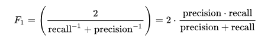

# Processo Seletivo Vagas - Cientista de Dados Sr.

## Considerações sobre o desafio

* O prazo padrão para entrega da solução é de 7 dias corridos, contados a partir da data de recebimento do desafio. Caso você precise de mais tempo, entre em contato conosco e fechamos uma nova data para a entrega. Não se preocupe, somos super flexíveis ;)
* A solução poderá ser feita em Python ou R e deverá rodar em um notebook jupyter
* Quando estiver tudo pronto, você deve mandar um e-mail para codesubmissions@vagas.com.br com o assunto `Cientista de Dados VAGAS.com - <%SEU_NOME%>` e o link para o seu repositório.

## Descrição

Os analistas de RH conduzem diversos processos seletivos simultaneamente e geralmente possuem pouco tempo para selecionarem o candidato certo para suas vagas.

Para facilitar a vida dos analistas de RH, você como cientista de dados recebeu o desafio de modelar uma máquina de aprendizado de classificação, capaz de prever o comportamento dos analistas no processo seletivo, ou seja, prever quais candidatos os analistas aprovariam em cada processo.

Para isso, a base de dados disponibilizada possui informações dos candidatos, das vagas e do processo seletivo (se o candidato foi ou não aprovado no processo.

Com a criação do modelo você permitirá que as pessoas certas sejam selecionadas para as vagas de forma mais rápida e eficaz, facilitando assim a vida dos analistas de RH e dos candidatos (quem não gostaria de receber o feedback de sua participação em um processo seletivo o mais rápido possível? ;o)

## Objetivo

Modelar uma máquina de aprendizado que seja capaz de prever quais candidatos serão aprovados no processo seletivo.

## Métrica

Neste desafio você deverá utilizar a métrica [F1-Score](https://en.wikipedia.org/wiki/F1_score)

## Base de Dados (treinamento e testes)

Para este desafio será disponibilizada uma base de dados fictícia já classificada com a variável target **aprovado_vaga** visando a utilização para treinamento e testes do modelo criado.

O arquivo está presente no diretório dataset com o nome **base_treinamento_testes.pkl** no formato [pickle](https://pandas.pydata.org/pandas-docs/stable/reference/api/pandas.DataFrame.to_pickle.html)) e pode ser facilmente lido com o comando *read_pickle* da biblioteca [pandas](https://pandas.pydata.org/pandas-docs/stable/reference/api/pandas.read_pickle.html).

Cada linha da base de dados representa a candidatura de um profissional distinto à uma determinada vaga (oportunidade de trabalho), em que os campos com a descrição **_candidato** representam atributos vinculados aos candidatos, e os campos com a descrição **_vaga** representam atributos vinculados às vagas.

O modelo deverá ser treinado com a variável target **aprovado_vaga**, que indica, com os valores binários **1** e **0**, se um candidato foi ou não aprovado no respectivo processo seletivo da vaga em questão.

Abaixo a descrição de cada um dos campos da base:

| *Campo* | *Descrição*  |
| ------------------------------------------ | ---- |
| codigo_vaga | Identificador único do processo seletivo|
| ultimo_salario_candidato| Salário referente à última posição exercida pelo candidato|
| ultimo_cargo_candidato| Cargo referente à última posição exercida pelo candidato|
| area_interesse_candidato | Área de interesse selecionada pelo candidato no momento do cadastro do Currículo|
| nivel_candidato | Nível profissional máximo atingido pelo candidato|
| formacao_candidato | Última formação acadêmica do candidato|
| cidade_candidato | Nome da cidade onde o candidato reside|
| nivel_ingles_candidato | Nível de inglês (0 a 4) com o nível de fluência em inglês indicado pelo candidato (onde 0 é “não possui” e 4 é inglês fluente) |
| nivel_espanhol_candidato | Nível de espanhol (0 a 4) com o nível de fluência em espanhol indicado pelo candidato (onde 0 é “não possui” e 4 é inglês fluente)|
| mediana_teste_ingles_candidato | Mediana das notas obtidas pelos candidatos em testes de inglês|
| mediana_teste_espanhol_candidato | Mediana das notas obtidas pelos candidatos em testes de espanhol|
| mediana_teste_logica_candidato | Mediana das notas obtidas pelos candidatos em testes de lógica|
| mediana_teste_outros_candidato | Mediana das notas obtidas pelos candidatos em outros testes gerais|
| cargo_vaga | Cargo “normalizado” (processo de padronização) referente à posição requerida na vaga. Pode conter dados sem classificação|
| nivel_vaga | Nível profissional requerido na vaga|
| formacao_vaga | Formação Acadêmica requerida na vaga|
| cidade_vaga | Nome da cidade para atuação do profissional|
| aprovado_vaga | Indicativo (1/0) se o candidato passou foi aprovado no processo em questão. O valor 1 é relativo a candidatos que foram aprovados e o valor 0 (zero) à candidatos não aprovados|

## Base de dados (submissão)

Para predição do modelo treinado você deverá utilizar o arquivo **base_submission.pkl** este arquivo contém os mesmos campos da base de *treinamento / testes* com exceção do campo target **aprovado_vaga** que foi removido desta base.

Ao final da predição você deverá exportar um arquivo de submissão chamado **resultado.pkl** com o resultado da predição nos valores **1** ou **0** para as predições de aprovado ou não aprovado (por favor utilize o formato de arquivo [pickle](https://pandas.pydata.org/pandas-docs/stable/reference/api/pandas.DataFrame.to_pickle.html))

O arquivo deverá conter apenas uma coluna chamada **aprovado_vaga** onde cada linha deverá ser o retorno vinculado aos dados do arquivo **base_submission.pkl** na mesma ordem do arquivo original.

## Avaliação

Para avaliação do desafio serão analisados o resultado alcançado com a predição utilizando a métrica *F1-Score* e também o raciocínio lógico aplicado pelo candidato no desafio à vaga de Cientista de Dados.  Para isso, solicitamos que também seja disponibilizado o arquivo [jupyter (.ipynb)](https://jupyter.org/) com o código utilizado para estudo e treinamento do modelo.

## Considerações finais
Esperamos que você se divirta codificando essa solução. Estamos aqui (codesubmissions@vagas.com.br) caso surjam dúvidas durante o desenvolvimento.

Boa sorte :)
